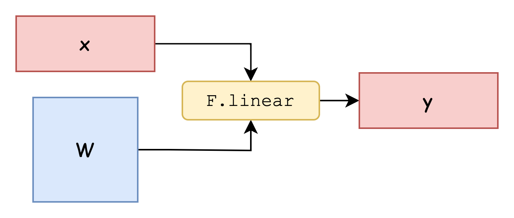
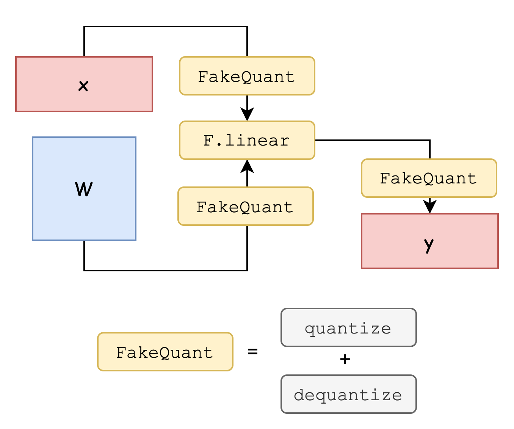

# 旋转量化实现
## 背景
在端侧部署大语言模型（LLM）面临算力、内存和能耗等多方面限制，传统的全精度模型往往难以满足移动设备的资源约束。为了在保证推理速度和响应性能的同时降低模型大小和计算开销，量化成为关键的优化手段。通过将模型参数和中间激活从高精度浮点数转换为低位宽整数表示，量化能够显著压缩模型体积、提升运行效率，并充分利用端侧硬件对低精度计算的支持，从而实现更高效的本地推理。

## 前置知识
1. 在做本考核前，需要对量化的原理有所了解，至少需要理解linear quantization的原理，可以参考Song Han的[TinyML](https://hanlab.mit.edu/courses/2024-fall-65940)课程，具体参考其中的[Quantization Part1](https://www.dropbox.com/scl/fi/qc2s9opsa2mnqfithvwz1/Lec05-Quantization-I.pdf?rlkey=sizfzkdv85etnplz1nqgngeql&st=zr1y81q7&dl=0)和[Quantization Part2](https://www.dropbox.com/scl/fi/qt970xoje5d1btek4a8cl/Lec06-Quantization-II.pdf?rlkey=lalxz5ed2hez0olwu4e4gokbj&st=f1oof15v&dl=0).
2. 理解Linear Quantization为何会带来精度损失，为何outlier会使量化后模型精度下降严重.
3. 了解经典工作[SmoothQuant](https://arxiv.org/abs/2211.10438)如何缓解outlier带来的量化损失.

## 基于旋转的量化实现
阅读旋转量化论文[QuaRot](https://arxiv.org/abs/2404.00456)，要求准确的理解该文章中如何通过旋转模型中某些权重来缓解outlier带来的问题。

**回答以下问题**
- 简要回答QuaRot如何通过旋转操作来缓解outlier，最好能用数学公式描述一下其中的操作并说明为何旋转前后模型是等价的.
- QuaRot的第一步要将模型中Norm操作中的weight和bias融合进其后紧邻着的linear层中(具体说明可以阅读项目根目录的[README](../README.md))。说明为何这一步是必要的。

### 代码实现
你需要使用QuaRot中的方法来旋转并量化某个端侧小模型（如果不知道选什么可以选Llama3.2-1B-Instruct、Phi-4-mini-instruct...）。你不需要完全实现QuaRot的功能，其中的online rotation部分会改变模型结构并且引入额外的开销，因此在本代码框架中并没有实现online rotation。Attention层中的K/V也不需要旋转，因为Attention的计算使用fp而不是int计算。你可以参考代码框架中对[`Qwen2.5`](../example/qwen2.5-instruct.py)的旋转实现.

#### 理解框架运行流程
阅读[README.md](../README.md)，理解该代码框架的执行流程。`Qwen2.5`旋转的例子见[Qwen2.5-instruct.py](../example/qwen2.5-instruct.py)，其中旋转的接口为`rotate.rotate_model(model, ...)`，该函数随后会依次调用[`qwen.py`](../rotate/model/qwen.py)中使用`@RotateOperationRegistry.register(Qwen2ForCausalLM)`修饰的函数，这些函数完成了模型旋转的操作。

#### 完成基本module的旋转操作
阅读[common.py](../rotate/common.py)中的`op_rotate_linear_input`函数，该函数作用为改变linear的行为，linear操作原本如下
```math
linear(x) = xW+b
```
经过该变换后linear操作行为如下
```math
linear(x) = (xR)W + b
```
即先将输入旋转后再进行原来的线性变换。你可以参照着[common.py](../rotate/common.py)中最后的测试代码来理解该函数的作用，在根目录执行命令`python rotate/common.py`可以看到输出
```bash
rotate_input operation for nn.Linear passed
Traceback (most recent call last):
  File "/data/shrelic/other/RotLLM/rotate/common.py", line 415, in <module>
    assert torch.allclose(y_new, y_rotated, atol=1e-5), "rotate_output operation failed"
           ^^^^^^^^^^^^^^^^^^^^^^^^^^^^^^^^^^^^^^^^^^^
AssertionError: rotate_output operation failed
```
接下来你需要完成`op_rotate_linear_output`和`op_rotate_embedding`这两个函数，要求执行`python rotate/common.py`后可以通过测试。

#### 完成对一个模型的旋转操作（可选Llama3.2-1B）
阅读[`qwen.py`](../rotate/model/qwen.py)中`@RotateOperationRegistry.register(Qwen2ForCausalLM)`修饰的函数，对`Qwen2.5`进行旋转操作会依次调用`apply_untie_word_embeddings`，`apply_fuse_layer_norms`和`apply_rotate_model`，理解这些操作都做了什么。

接下来你需要在[`qwen.py`](../rotate/model/qwen.py)同级目录下创建一个`llama.py`，模仿[`qwen.py`](../rotate/model/qwen.py)完成对`Llama3.2-1B`的旋转操作（你也可以选择其他模型）。

模仿[`Qwen2.5`](../example/qwen2.5-instruct.py)编写一个example来查看旋转前后的`Llama3.2-1B`是否可以输出正常的文本。

#### 模拟动态量化操作
正常的`nn.Linear`操作示意图如下

现在需要你实现一个模拟的动态量化的推理，将`nn.Linear`变为一个`FakeQuantLinear`，示意图如下：


查看[linear.py](exam/fakequant.png)，完成其中的`FakeQuantLinear`，并使用`replace_linear_with_fakequant`来替换你的模型中的`nn.Linear`，对比量化前后模型输出差别。

#### 加分项：测试PPL
在前面你已经完成了模型的旋转和`FakeQuant`操作，需要有一个指标直观的衡量旋转前后量化结果的差异，PPL是其中一个常用的指标。编写代码测试模型在某个数据集（如wikitext）上的PPL，对比以下几种情况的PPL:
1. 原始模型
2. 直接在原始模型基础上量化的模型
3. 旋转后再量化的模型

